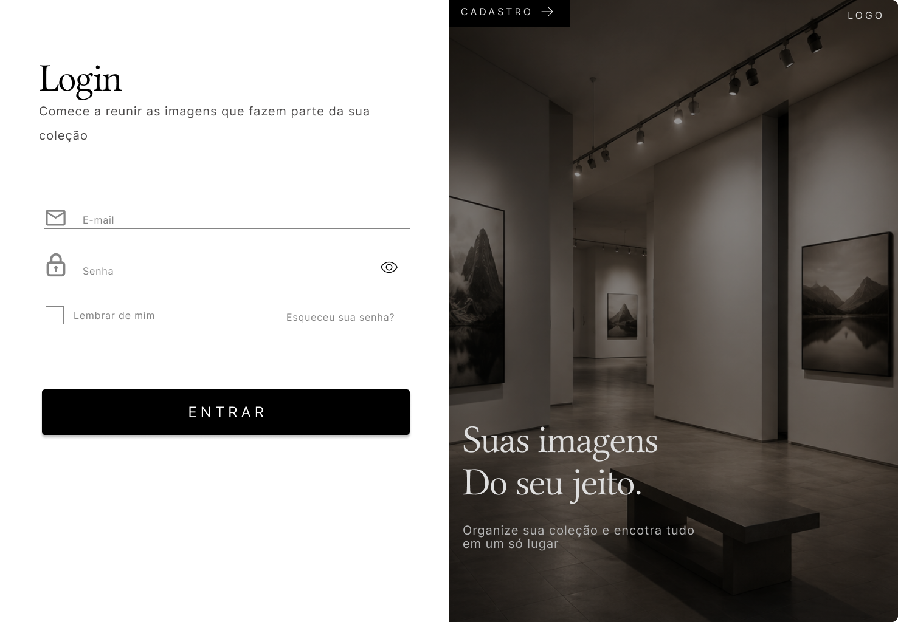
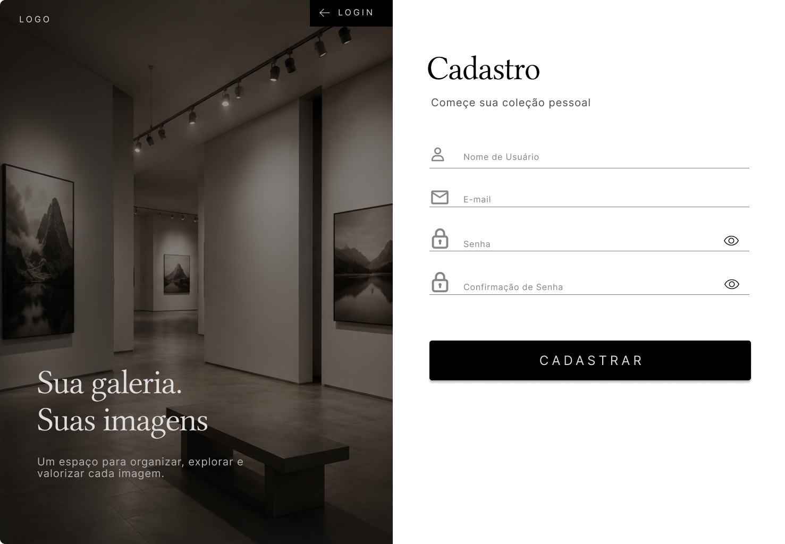
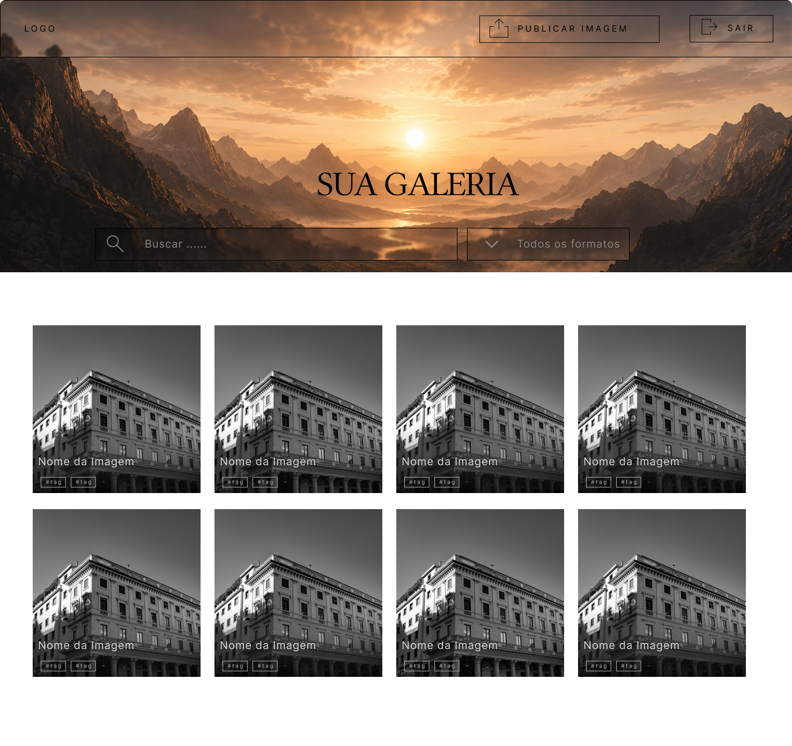
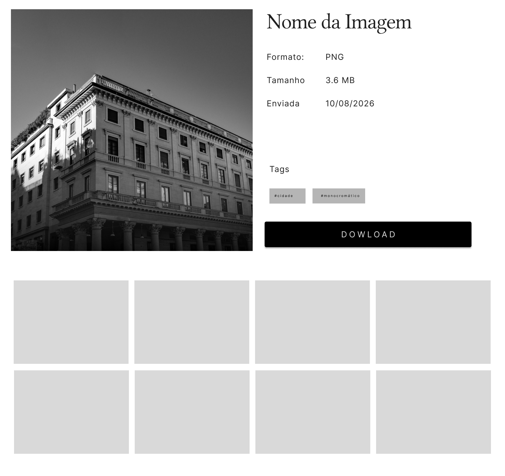

# 🖼️ ImagemPeças

> Álbum de imagens de peças industriais com autenticação de usuários, publicação e pesquisa de imagens.

---

## 📋 Requisitos Funcionais

| ID | Requisito | Funcionalidade relacionada |
|:---:|---|---|
| **RF01** | O sistema deve permitir que um visitante crie uma conta informando **nome, e-mail e senha**. | 👤 Cadastro de usuário |
| **RF02** | O sistema deve impedir o cadastro de um **e-mail já existente**. | 🔐 Validação do cadastro |
| **RF03** | O sistema deve permitir que um usuário cadastrado se **autentique com e-mail e senha**. | 🔑 Login |
| **RF04** | O sistema deve emitir um **token de acesso (JWT)** após autenticação bem-sucedida. | 🎫 Autenticação JWT |
| **RF05** | O sistema deve permitir que o usuário autenticado **encerre sua sessão**. | 🚪 Logout |
| **RF06** | O sistema deve permitir que o usuário autenticado **publique uma nova imagem**, informando nome, tags e arquivo. | 📤 Publicação de imagem |
| **RF07** | O sistema deve validar o **formato (PNG, JPEG, GIF) e o tamanho** do arquivo antes do envio. | ✅ Validação da imagem |
| **RF08** | O sistema deve permitir que o usuário **pesquise imagens por nome, tag e/ou extensão**. | 🔎 Pesquisa e filtros |
| **RF09** | O sistema deve exibir as imagens encontradas em **formato de galeria**, com nome, extensão, tamanho e data de upload. | 🖼️ Galeria de imagens |
| **RF10** | O sistema deve permitir a **visualização da imagem em tamanho real** a partir da miniatura. | 🔍 Visualização da imagem |
| **RF11** | O sistema deve **notificar o usuário sobre sucesso ou falha** de cada operação realizada. | 🔔 Notificações e feedback |

---

## 🎨 Protótipos

Os protótipos das telas foram organizados de acordo com o fluxo principal da aplicação e relacionados aos respectivos requisitos funcionais.

### 🔐 Autenticação

#### Tela de Login — RF03

#### Tela de Cadastro — RF01 e RF02

---

### 🖼️ Galeria

#### Tela Principal — RF05, RF08 e RF09

#### Variação em modo escuro

#### Variação neutra

> As diferentes versões da tela inicial representam variações visuais da mesma área da aplicação.

---

### 📤 Publicação de Imagem

#### Tela de Publicação — RF06 e RF07

---

### 🔍 Visualização em Tamanho Real

#### Tela de Detalhes — RF10

---

### 🔔 Notificações e Feedback — RF11

O requisito **RF11** é transversal às principais operações do sistema. As notificações de sucesso ou falha podem aparecer nas telas de cadastro, autenticação, publicação e pesquisa, não correspondendo a uma tela independente.

---

## 🔗 Rastreabilidade

A relação entre os requisitos e os casos de uso definida no roteiro é:

| Requisito | Caso de Uso |
|:---:|---|
| **RF01, RF02** | CSU01 — Cadastrar-se |
| **RF03, RF04** | CSU02 — Autenticar-se |
| **RF05** | CSU03 — Encerrar Sessão |
| **RF06, RF07** | CSU04 — Publicar Imagem |
| **RF08, RF09** | CSU05 — Pesquisar Imagens |
| **RF10** | CSU06 — Visualizar Imagem em Tamanho Real |
| **RF11** | Transversal — CSU01, CSU02, CSU04 e CSU05 |

> A organização da rastreabilidade segue a definição apresentada no roteiro do projeto. fileciteturn0file0
